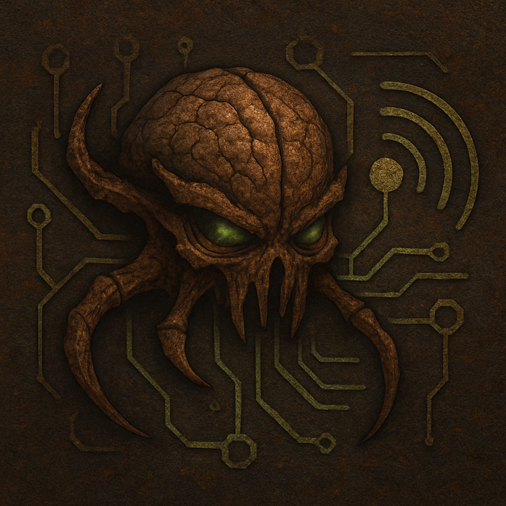

# Hivemind Factorio Mod

## Description

Hivemind is a Factorio mod designed to export comprehensive stateful game information to a third-party service. This data is intended to be consumed by an external NodeJS companion service (to be announced) which will provide advanced AI Agent functionality to the alien faction within Factorio, creating a more dynamic and challenging enemy.

## Features

The mod collects and exports the following game state information:

- **Current Game State:** Tick, game time, evolution factor, and pollution levels.
- **Player Information:** Connected players (count and names), player turret counts (bullet, laser, flame, artillery), and player advancement statistics (research progress, kills, production, etc.). Also includes player-placed map tags.
- **Enemy Information:** Counts of enemy spawners, worms, biters, and spitters by size.
- **Chat History:** Recent in-game chat messages (configurable retention).
- **Event History:** Summarized game events, including:
  - Enemy attacks on player bases.
  - Player building destruction by enemies.
  - Unit deaths.
  - Player deaths.

This data is exported periodically to a JSON file within the mod's directory.

## Installation

1.  Download the `Hivemind_0.1.0.zip` file (or the equivalent version). **Note: You may need to package the mod directory into a zip file yourself if you cloned the repository directly.**
2.  Locate your Factorio user data directory. This varies depending on your operating system:
    - **Windows:** `%APPDATA%\Factorio`
    - **macOS:** `~/Library/Application Support/factorio`
    - **Linux:** `~/.factorio`
3.  Navigate to the `mods` subdirectory within your Factorio user data directory.
4.  Place the `Hivemind_0.1.0.zip` file into the `mods` directory.
5.  Launch Factorio. The mod should appear in the "Mods" menu and be enabled by default.

## Configuration

The mod provides several startup settings that can be configured in Factorio's "Settings" menu under the "Startup" tab. These settings control the retention of chat and event history, and the frequency of the data export:

- `hivemind_chat_retention_seconds`: How long chat messages are kept in memory before pruning (default: 60 seconds).
- `hivemind_chat_max_messages`: Maximum number of chat messages to retain (default: 5).
- `hivemind_event_retention_seconds`: How long event history groups are kept in memory before pruning (default: 60 seconds).
- `hivemind_event_max_groups`: Maximum number of event groups to retain (default: 5).
- `hivemind_export_interval_seconds`: The interval, in seconds, between each data export cycle (default: 1 second).

## JSON Export Format

The mod exports the collected stateful information to `hivemind.json` within the mod's save data directory (typically found within your Factorio user data directory, specific location depends on your OS and save name). The JSON structure includes the following top-level keys:

- `tick`: The current game tick.
- `game_time`: The current game time in HH:MM:SS format.
- `evolution_factor`: The current enemy evolution factor.
- `pollution`: The total pollution level on the Nauvis surface.
- `player`: Object containing player-specific information:
  - `turrets`: Object with counts of different turret types.
  - `advancement`: Object with various player progress statistics.
  - `connected_count`: Number of connected players.
  - `connected_names`: Array of connected player names.
  - `map_tags`: Array of player-placed chart tags (name and position).
- `enemy`: Object containing enemy entity counts (spawners, worms, biters, spitters).
- `event_summary`: Object summarizing recent event groups:
  - `player_losses`: Array of summarized player and player building losses.
  - `enemy_losses`: Array of summarized enemy unit losses.
  - `enemy_attacks`: Array of summarized enemy attack events.
- `chat`: Array of recent chat messages (game time, tick, player, message).

The exact structure and contents of nested objects and arrays can be best understood by examining the `hivemind.json` file generated by the mod during gameplay and the `modules/export.lua` script.

## Companion Service (To Be Announced)

This mod is designed to work in tandem with a separate NodeJS service that will process the exported game state data to control and enhance the behavior of the alien faction. Details about this companion service will be announced separately.

## Credits

- **Author:** Tyler Straub
